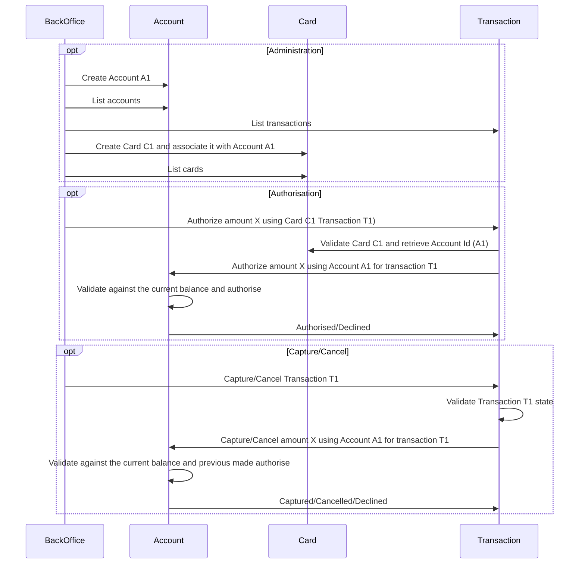
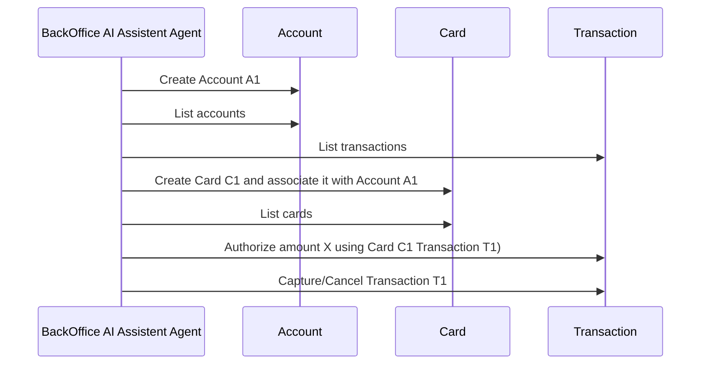

# Demo

## Sequence diagram

## Sequence diagram with AI

## Local run

Compile and publish locally the API project
```bash
mvn compile install -pl api
```

Run corebanking service
```bash
 mvn compile exec:java -pl corebanking
```
Run payments service
```bash
 mvn compile exec:java -pl payments
```
Run backoffice service
```bash
 mvn compile exec:java -pl backoffice
```

## Local CLI test

Create Account
```bash
grpcurl -plaintext -d '{"account_id": "account-123", "initial_balance": 1000}' \
  localhost:9002 api.account.com.example.akka.backoffice.AccountGrpcEndpoint/CreateAccount
```

Create Card
```bash
grpcurl -plaintext -d '{"pan": "4111111111111111", "expiry_date": "12/25", "cvv": "123", "account_id": "account-123"}' \
  localhost:9001 api.payments.com.example.akka.backoffice.CardGrpcEndpoint/CreateCard
```

Authorize transaction
```bash
grpcurl -plaintext -d '{
  "idempotency_key": "unique-key-123", 
  "transaction_id": "txn-456", 
  "card_pan": "4111111111111111", 
  "card_expiry_date": "12/25", 
  "card_cvv": "123", 
  "amount": 500, 
  "currency": "USD"
}' \
  localhost:9001 api.payments.com.example.akka.backoffice.TransactionGrpcEndpoint/StartTransaction
```

Get transaction:
```bash
grpcurl -plaintext -d '{"idempotency_key": "unique-key-123"}' \
  localhost:9001 api.payments.com.example.akka.backoffice.TransactionGrpcEndpoint/GetTransaction
```

Capture Transaction:
```bash
grpcurl -plaintext -d '{"idempotency_key": "unique-key-123"}' \
  localhost:9001 api.payments.com.example.akka.backoffice.TransactionGrpcEndpoint/CaptureTransaction
```